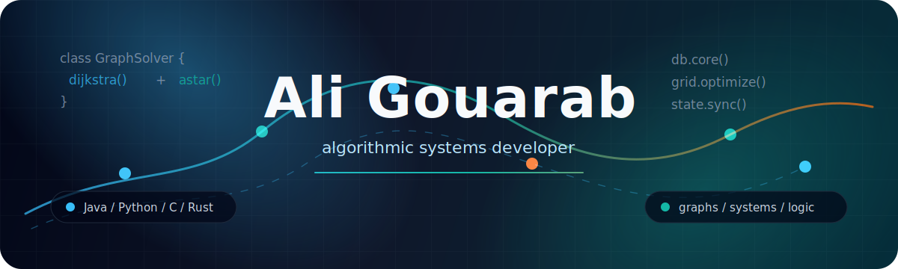

  

  
  
  

  

 

<table>
  <tr>
    <td width="58%" valign="top">
      <h2>Developer Signal</h2>
      

        I like projects where the logic matters: shortest paths, database internals,
        graph modeling, optimization, and multiplayer rules that need to stay reliable.
      

      <ul>
        <li>Ali Gouarab, based in Paris, France.</li>
        <li>Main stack: Java and Python.</li>
        <li>Building around algorithms, systems, and data structures.</li>
        <li>Exploring lower-level programming with C and Rust.</li>
      </ul>
    </td>
    <td width="42%" valign="top">
      <h2>Current Mode</h2>
      
<code>focus</code> graph algorithms and systems fundamentals

      
<code>building</code> practical projects with inspectable logic

      
<code>learning</code> deeper performance and low-level concepts

      
<code>style</code> clean code, clear models, useful abstractions

    </td>
  </tr>
</table>

## Core Stack

  

  
  
  
  
  

## Featured Work

<table>
  <tr>
    <td width="50%" valign="top">
      <h3><a href="https://github.com/static2358/DBMS">DBMS</a></h3>
      
Lightweight database management system built to demonstrate core DBMS concepts.

      

    </td>
    <td width="50%" valign="top">
      <h3><a href="https://github.com/static2358/MapPathFinder">MapPathFinder</a></h3>
      
Dijkstra and A* compared on weighted graphs and text-based maps.

      

    </td>
  </tr>
  <tr>
    <td width="50%" valign="top">
      <h3><a href="https://github.com/static2358/PixelPathFinder">PixelPathFinder</a></h3>
      
Images modeled as weighted graphs to visualize shortest-path algorithms.

      

    </td>
    <td width="50%" valign="top">
      <h3><a href="https://github.com/static2358/ElectricityNetwork">ElectricityNetwork</a></h3>
      
Electrical grid management, stability, and energy distribution optimization.

      

    </td>
  </tr>
  <tr>
    <td width="50%" valign="top">
      <h3><a href="https://github.com/static2358/MultiplayerSudoku">MultiplayerSudoku</a></h3>
      
A multiplayer Sudoku game focused on shared puzzle state and game logic.

      

    </td>
    <td width="50%" valign="top">
      <h3><a href="https://github.com/static2358/static2358.github.io">static2358.github.io</a></h3>
      
Personal website hosted with GitHub Pages.

      

    </td>
  </tr>
</table>

## GitHub Pulse

  
  

  

  

  <code>clean logic</code>
  <code>graph thinking</code>
  <code>systems mindset</code>
  <code>practical builds</code>

